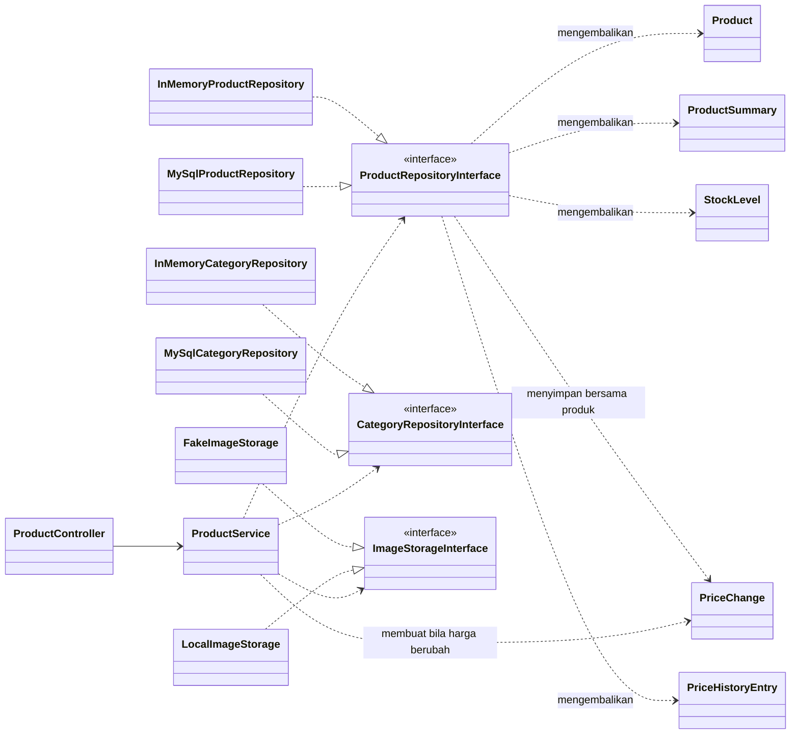
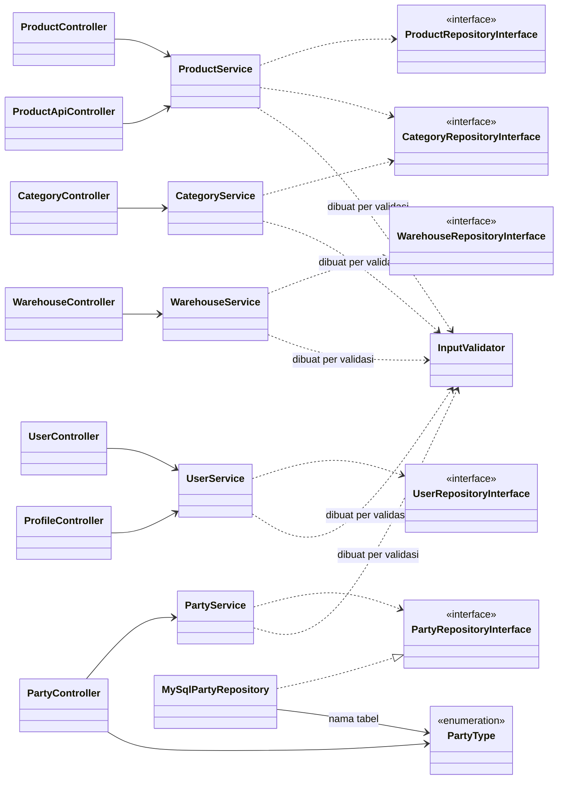
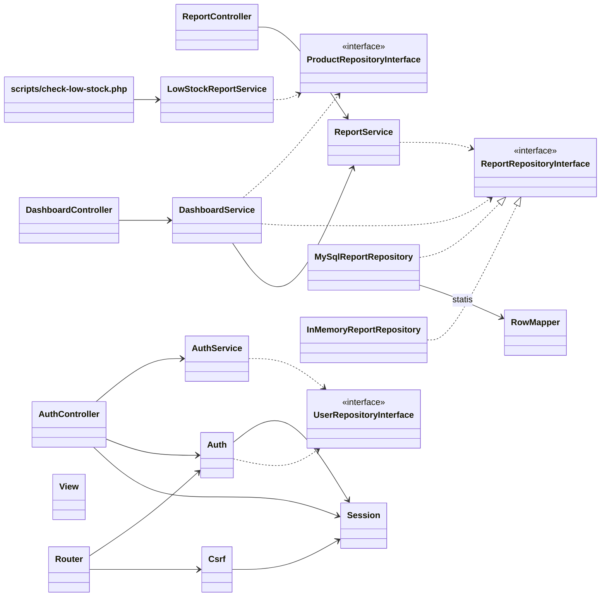

# Class Diagram — As-Built (DESIGN-01)

Diagram ini menggambarkan kode final per **2026-10-07** (diperbarui setelah jawaban trainer K-01…K-08: transfer stok, pembuat PO, harga SO dari form).
Diagram rencana awal ada di [`docs/planning/class-diagram-initial.md`](../planning/class-diagram-initial.md).

**Cara diagram ini dibuat:** setiap panah dependency diambil dari **parameter konstruktor**
lewat Reflection PHP (`ReflectionClass::getConstructor()`) di container, bukan dari ingatan.
Saat defense, setiap panah bisa dicocokkan dengan `__construct(...)` kelas terkait dan dengan
perakitan objek di composition root [`public/index.php`](../../public/index.php).

## Legenda

| Notasi | Arti |
|---|---|
| `A ..> B` (garis putus-putus) | A bergantung pada **interface** B (Dependency Inversion) |
| `A --> B` (garis penuh) | A bergantung pada **kelas konkret** B |
| `A ..\|> B` | A **mengimplementasikan** interface B |
| `A *-- B` | A **membuat sendiri** B di konstruktornya (kolaborator murni tanpa I/O) |
| `<<interface>>` | kontrak; implementasi produksi `MySql*`, implementasi test `InMemory*`/`Fake*` |

Diagram dibagi per modul agar tetap terbaca. Entity (objek data immutable di `app/Entity`)
hanya dicantumkan di diagram 1; di diagram lain mereka adalah tipe parameter/return.

---

## 1. Gambaran berlapis: Controller → Service → Repository (ARCH-01)

`MySql*` dipakai aplikasi & integration test; `InMemory*`/`Fake*` (di `tests/Fake/`) dipakai
unit test, sehingga aturan bisnis diuji tanpa database (ARCH-01). Pola yang sama berlaku di
semua modul berikut.

Riwayat harga mengikuti pola `StockChange`/`StockMovement`: `PriceChange` adalah write model
yang dibuat `ProductService` (harga awal saat create, atau hanya bila harga beli/jual berubah
saat update), lalu `create()`/`update()` repository menulisnya dalam transaksi yang sama dengan
baris `products`. `PriceHistoryEntry` adalah read model untuk halaman detail produk.

---

## 2. Order & stok — PO, SO, transfer, goods receipt/issue (PO-01, SO-01, K-08, ARCH-02)

```mermaid
classDiagram
    direction TB
    class PurchaseOrderController
    class SalesOrderController
    class StockTransferController
    class StockTransferService
    class StockTransferRepositoryInterface
    <<interface>> StockTransferRepositoryInterface
    class MySqlStockTransferRepository
    class PurchaseOrderService
    class SalesOrderService
    class StockService {
      +apply(list~StockChange~) void
    }
    class SalesOrderPolicy {
      +canView() bool
      +canSubmit() bool
      +canReview() bool
      +canFulfill() bool
      +canCancel() bool
    }
    class OrderLineValidator
    class TransactionManagerInterface
    <<interface>> TransactionManagerInterface
    class PurchaseOrderRepositoryInterface
    <<interface>> PurchaseOrderRepositoryInterface
    class SalesOrderRepositoryInterface
    <<interface>> SalesOrderRepositoryInterface
    class StockRepositoryInterface
    <<interface>> StockRepositoryInterface
    class PartyRepositoryInterface
    <<interface>> PartyRepositoryInterface
    class WarehouseRepositoryInterface
    <<interface>> WarehouseRepositoryInterface
    class ProductRepositoryInterface
    <<interface>> ProductRepositoryInterface
    class PdoTransactionManager
    class MySqlPurchaseOrderRepository
    class MySqlSalesOrderRepository
    class MySqlStockRepository
    class ImmediateTransactionManager
    class InMemoryStockRepository

    PurchaseOrderController --> PurchaseOrderService
    SalesOrderController --> SalesOrderService
    SalesOrderController --> SalesOrderPolicy

    PurchaseOrderService ..> PurchaseOrderRepositoryInterface
    PurchaseOrderService ..> PartyRepositoryInterface : supplier
    PurchaseOrderService ..> WarehouseRepositoryInterface
    PurchaseOrderService ..> ProductRepositoryInterface
    PurchaseOrderService ..> StockRepositoryInterface : riwayat ledger
    PurchaseOrderService ..> TransactionManagerInterface
    PurchaseOrderService --> StockService
    PurchaseOrderService *-- OrderLineValidator

    SalesOrderService ..> SalesOrderRepositoryInterface
    SalesOrderService ..> PartyRepositoryInterface : customer
    SalesOrderService ..> WarehouseRepositoryInterface
    SalesOrderService ..> ProductRepositoryInterface
    SalesOrderService ..> StockRepositoryInterface : riwayat ledger
    SalesOrderService ..> TransactionManagerInterface
    SalesOrderService --> StockService
    SalesOrderService --> SalesOrderPolicy
    SalesOrderService *-- OrderLineValidator

    StockService ..> StockRepositoryInterface
    OrderLineValidator ..> ProductRepositoryInterface

    PdoTransactionManager ..|> TransactionManagerInterface
    ImmediateTransactionManager ..|> TransactionManagerInterface
    MySqlPurchaseOrderRepository ..|> PurchaseOrderRepositoryInterface
    MySqlSalesOrderRepository ..|> SalesOrderRepositoryInterface
    MySqlStockRepository ..|> StockRepositoryInterface
    InMemoryStockRepository ..|> StockRepositoryInterface

    StockTransferController --> StockTransferService
    StockTransferService ..> StockTransferRepositoryInterface
    StockTransferService ..> WarehouseRepositoryInterface
    StockTransferService ..> ProductRepositoryInterface
    StockTransferService ..> StockRepositoryInterface : riwayat ledger
    StockTransferService ..> TransactionManagerInterface
    StockTransferService --> StockService
    StockTransferService *-- OrderLineValidator
    MySqlStockTransferRepository ..|> StockTransferRepositoryInterface
```

Inti ARCH-02 ([ADR-001](adr-001-mekanisme-anti-oversell.md)) ada di dua kelas:

- `StockService::apply()`: kunci baris stok berurutan, tolak bila kurang, lalu catat.
- `MySqlStockRepository`: `lockQuantities()` dengan `FOR UPDATE`, dan `recordMovement()`
  yang menulis ledger + stok dengan guard `quantity + delta >= 0`.

Batas transaksi dimiliki `PurchaseOrderService` / `SalesOrderService` / `StockTransferService` lewat
`TransactionManagerInterface`. Aturan otorisasi SO ada di `SalesOrderPolicy`
([ADR-002](adr-002-otorisasi-sales-order.md)).

---

## 3. Katalog, master data & user (PRD-01, WH-01, USR-01)

Supplier dan customer memakai satu `PartyService` / `PartyController` / `MySqlPartyRepository`.
Composition root merakit dua instance, masing-masing dengan `PartyType::Supplier` dan
`PartyType::Customer`. `InputValidator` (refactor R-01) bukan dependency konstruktor: objek
baru dibuat untuk setiap form yang divalidasi.

---

## 4. Dashboard, laporan, API & script; inti HTTP (DASH-01, REPORT-01, API-01, JOB-01, AUTH)

Dashboard dan CSV memakai `ReportRepositoryInterface` yang sama, sehingga angka di layar dan
di file selalu identik (syarat REPORT-01). `Router`, `Auth`, `Session`, `Csrf`, dan `View`
adalah lapisan HTTP (`app/Core`). Service tidak pernah menyentuh session maupun superglobal.

Semua controller (diagram 2–4) juga bergantung pada `View` dan, untuk form, `Session` (flash).
Panah itu tidak digambar agar diagram tetap terbaca.

---

## Apa yang berubah dari diagram initial, dan mengapa

Rencana awal menaruh goods receipt/issue di `StockService::receive(poId)` / `issue(soId)`.
Saat dibangun, `StockService` dipersempit menjadi `apply(list<StockChange>)` yang hanya
mengurus lock, cek, dan ledger stok, sementara aturan dokumen PO/SO serta batas transaksinya
pindah ke `PurchaseOrderService` / `SalesOrderService`. Alasannya: satu transaksi bisa
mencakup status order, item, dan stok sekaligus, dan `StockService` tidak perlu tahu soal
PO/SO (lihat [audit SRP](../quality/srp-audit.md)).

Muncul beberapa abstraksi yang tidak ada di rencana karena kebutuhan nyata:
- `TransactionManagerInterface`, supaya service mengatur transaksi tanpa bergantung pada PDO.
- `SalesOrderPolicy`, untuk otorisasi per order yang tidak bisa diekspresikan router.
- `ReportRepositoryInterface`, yang dipakai bersama dashboard dan CSV.
- `InputValidator`, `OrderLineValidator`, dan `RowMapper`, hasil refactor R-01 sampai R-03
  untuk menghapus duplikasi.

Supplier dan customer disatukan menjadi `Party` + `PartyType` karena field-nya identik di §1.3.

| Area | Initial (rencana) | As-built |
|---|---|---|
| Operasi stok | `StockService::receive/issue` per dokumen | `StockService::apply(StockChange[])`; PO/SO service memegang aturan dokumen & transaksi |
| Transaksi | tidak digambarkan | `TransactionManagerInterface` ← `PdoTransactionManager` / `ImmediateTransactionManager` |
| Otorisasi SO | di `SalesOrderService` | `SalesOrderPolicy`, dipakai service (menegakkan) dan view (tombol) |
| Laporan | `ReportController --> DashboardService` | `ReportController --> ReportService`; `DashboardService --> ReportService`; keduanya `..> ReportRepositoryInterface` |
| Transfer antar-gudang | tidak ada | `StockTransferService` (K-08) memakai ulang `StockService::apply` tanpa mengubahnya: Issue asal + Receipt tujuan per item |
| Supplier/Customer | dua repository terpisah (tersirat) | satu `PartyRepositoryInterface` + `PartyType` |
| API JSON | `ProductApiController --> ProductService` | sama (sesuai rencana) |
| Validasi | di tiap service | `InputValidator` (R-01), `OrderLineValidator` (R-02) |
| Mapping baris DB | di tiap repository | `RowMapper` (R-03) |
