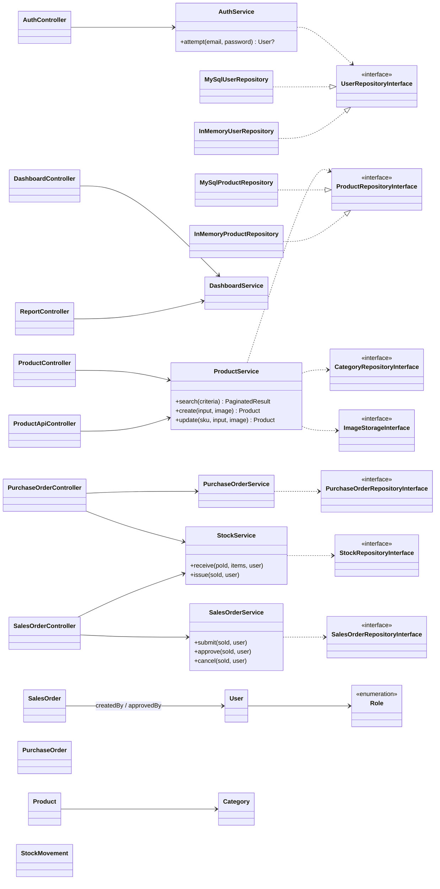

# Class Diagram — Initial (rencana sebelum coding PHP)

Dibuat 2026-10-02, **sebelum** kode PHP pertama ditulis (DESIGN-01). Diagram ini
adalah rencana; versi *as-built* akan dibuat di `docs/architecture/` di akhir
project, lengkap dengan catatan apa yang berubah dan alasannya.

## Prinsip yang direncanakan

- Tiga layer pragmatis (ARCH-01): **Controller** (HTTP: baca request, panggil
  service, pilih view/redirect) → **Service** (aturan bisnis & validasi) →
  **Repository** (SQL lewat PDO prepared statement).
- Service hanya bergantung pada **interface** repository (Dependency
  Inversion), sehingga unit test memakai implementasi in-memory tanpa MySQL.
- Wiring dependency dilakukan manual di satu tempat (`public/index.php`,
  *composition root*) lewat constructor injection — tanpa DI container.
- Entity berupa objek data sederhana (immutable), tidak tahu soal PDO/HTTP.
- Session, superglobal, dan PDO hanya disentuh oleh lapisan `Core` dan
  `Repository\MySql*` — tidak pernah oleh Service (ARCH-01).

## Diagram

Notasi: `..|>` = mengimplementasikan interface, `..>` = bergantung pada
**interface**, `-->` = bergantung pada **kelas konkret**.

## Rencana urutan implementasi (vertical slice, brief §2)

1. **Fondasi + Auth + Produk** (slice pertama): `Core` (router, request,
   session, CSRF, view), login/logout, guard role, CRUD produk dengan upload
   gambar, unit test service dengan fake repository, integration test
   repository MySQL.
2. Master data lain (kategori, gudang, supplier, customer, user).
3. Purchase Order + goods receipt (`StockService::receive`, transaksi).
4. Sales Order + approval + goods issue (`StockService::issue`,
   mekanisme anti-oversell ARCH-02 — akan diputuskan lewat ADR).
5. Dashboard per role, laporan CSV, endpoint JSON API, script low-stock.
