# Entity Relationship Diagram — Inventory & Order Management System

Skema ini menerjemahkan model data §1.3 Project Brief (yang sebelumnya sudah
divalidasi lewat prototype JSON+localStorage) menjadi tabel relasional MySQL 8.
Implementasi SQL-nya ada di [`database/schema-and-seed.sql`](../../database/schema-and-seed.sql).

```mermaid
erDiagram
    CATEGORIES ||--o{ PRODUCTS : "mengelompokkan"
    PRODUCTS ||--o{ PRODUCT_STOCK : "punya stok per"
    WAREHOUSES ||--o{ PRODUCT_STOCK : "menyimpan"
    WAREHOUSES ||--o{ PURCHASE_ORDERS : "tujuan penerimaan"
    WAREHOUSES ||--o{ SALES_ORDERS : "asal pengeluaran"
    SUPPLIERS ||--o{ PURCHASE_ORDERS : "memasok"
    CUSTOMERS ||--o{ SALES_ORDERS : "memesan"
    PURCHASE_ORDERS ||--o{ PURCHASE_ORDER_ITEMS : "berisi"
    PRODUCTS ||--o{ PURCHASE_ORDER_ITEMS : "dipesan sebagai"
    SALES_ORDERS ||--o{ SALES_ORDER_ITEMS : "berisi"
    PRODUCTS ||--o{ SALES_ORDER_ITEMS : "dipesan sebagai"
    USERS ||--o{ SALES_ORDERS : "membuat (created_by)"
    USERS ||--o{ SALES_ORDERS : "menyetujui (approved_by)"
    PRODUCTS ||--o{ STOCK_LEDGER : "pergerakan"
    WAREHOUSES ||--o{ STOCK_LEDGER : "lokasi pergerakan"
    USERS ||--o{ STOCK_LEDGER : "melakukan"
    USERS ||--o{ PURCHASE_ORDERS : "membuat (created_by, K-03)"
    WAREHOUSES ||--o{ STOCK_TRANSFERS : "gudang asal"
    WAREHOUSES ||--o{ STOCK_TRANSFERS : "gudang tujuan"
    USERS ||--o{ STOCK_TRANSFERS : "melakukan"
    STOCK_TRANSFERS ||--o{ STOCK_TRANSFER_ITEMS : "berisi"
    PRODUCTS ||--o{ STOCK_TRANSFER_ITEMS : "dipindah sebagai"
    PRODUCTS ||--o{ PRODUCT_PRICE_HISTORY : "riwayat harga"
    USERS ||--o{ PRODUCT_PRICE_HISTORY : "mengubah (changed_by)"

    USERS {
        int id PK
        varchar name
        varchar email UK
        varchar password "bcrypt hash"
        enum role "Admin/Sales/Warehouse Staff"
        boolean active
    }
    WAREHOUSES {
        int id PK
        varchar name
        varchar location
        boolean active
    }
    CATEGORIES {
        int id PK
        varchar name
        varchar description
    }
    SUPPLIERS {
        int id PK
        varchar name
        varchar contact
        varchar address
        boolean active
    }
    CUSTOMERS {
        int id PK
        varchar name
        varchar contact
        varchar address
        boolean active
    }
    PRODUCTS {
        varchar sku PK
        varchar name
        int category_id FK
        varchar unit
        decimal buy_price
        decimal sell_price
        int reorder_point
        varchar image_url
        boolean active
    }
    PRODUCT_STOCK {
        int id PK
        varchar product_sku FK
        int warehouse_id FK
        int quantity "CHECK >= 0"
        timestamp updated_at
    }
    PURCHASE_ORDERS {
        int id PK
        varchar order_no UK
        int supplier_id FK
        int warehouse_id FK
        enum status "Draft/Ordered/PartiallyReceived/Received/Cancelled"
        date order_date
        int created_by FK "K-03"
    }
    PURCHASE_ORDER_ITEMS {
        int id PK
        int purchase_order_id FK
        varchar product_sku FK
        int qty "CHECK > 0"
        int received_qty "CHECK 0..qty"
        decimal buy_price
    }
    SALES_ORDERS {
        int id PK
        varchar order_no UK
        int customer_id FK
        int warehouse_id FK
        int created_by FK
        int approved_by FK "nullable"
        enum status "Draft/PendingApproval/Approved/Fulfilled/Cancelled"
        date order_date
    }
    SALES_ORDER_ITEMS {
        int id PK
        int sales_order_id FK
        varchar product_sku FK
        int qty "CHECK > 0"
        decimal price
    }
    STOCK_TRANSFERS {
        int id PK
        varchar transfer_no UK
        int from_warehouse_id FK
        int to_warehouse_id FK "CHECK beda dari asal"
        varchar note
        int created_by FK
        timestamp created_at
    }
    STOCK_TRANSFER_ITEMS {
        int id PK
        int stock_transfer_id FK
        varchar product_sku FK
        int qty "CHECK > 0"
    }
    STOCK_LEDGER {
        int id PK
        varchar product_sku FK
        int warehouse_id FK
        enum movement_type "Receipt/Issue/Adjustment"
        int quantity "positif=masuk, negatif=keluar"
        enum ref_type "PO/SO/ADJ/TRF"
        varchar ref_id "order_no terkait"
        int performed_by FK
        timestamp created_at
    }
    PRODUCT_PRICE_HISTORY {
        int id PK
        varchar product_sku FK
        decimal old_buy_price "NULL = harga awal"
        decimal new_buy_price
        decimal old_sell_price "NULL = harga awal"
        decimal new_sell_price
        int changed_by FK
        timestamp changed_at
    }
```

## Keputusan desain

- **`products.sku` sebagai primary key** (bukan surrogate `id`) — konsisten dengan
  seluruh prototype JS/JSON yang sudah dibangun, di mana SKU sudah dipakai sebagai
  business key alami di setiap referensi produk (form, tabel, ledger).
- **`product_stock` adalah tabel state saat ini**, bukan riwayat. Sumber kebenaran
  riwayat pergerakan ada di `stock_ledger` — service layer (nanti di PHP) wajib
  selalu menulis baris `stock_ledger` **lalu** meng-update `product_stock` dalam
  satu transaksi (lihat catatan transaksi di `schema-and-seed.sql`), bukan
  mengubah `product_stock` langsung dari controller.
- **`approved_by` nullable** pada `sales_orders` — order yang masih Draft/
  PendingApproval belum punya approver; constraint "Sales tidak boleh approve
  order sendiri" tetap harus ditegakkan di service layer (PHP), bukan lewat SQL,
  karena aturan itu bergantung pada role user saat request dibuat, bukan invarian
  data yang bisa dicek murni dari tabel.
- **`purchase_order_items.received_qty <= qty`** dijaga lewat `CHECK` constraint
  (MySQL 8.0.16+) — mencegah data cacat di level database, bukan cuma di aplikasi.
- **Tidak ada hard delete** di manapun — kolom `active` dipakai untuk
  menonaktifkan (produk, gudang, supplier, customer, user), sesuai §1.3.

## Pembaruan 2026-10-07 (jawaban trainer)

- **K-03:** `purchase_orders.created_by` (FK `users`) mencatat pembuat/pengusul PO.
- **K-08 transfer antar-gudang:** tabel `stock_transfers` (CHECK gudang asal ≠ tujuan) dan
  `stock_transfer_items` (qty > 0, satu baris per produk per transfer). Perubahan stoknya tetap
  hanya lewat `stock_ledger`: `Issue` di gudang asal + `Receipt` di gudang tujuan dengan
  `ref_type = TRF`, sehingga nilai tetap tipe pergerakan §1.3 (Receipt/Issue/Adjustment) tidak berubah.
- **Riwayat harga produk:** tabel `product_price_history` mencatat setiap perubahan harga
  beli/jual **master** produk (lama → baru, siapa, kapan); baris dengan harga lama `NULL` adalah
  harga awal saat produk dibuat. Ditulis dalam transaksi yang sama dengan `INSERT`/`UPDATE products`.
  Harga di `purchase_order_items`/`sales_order_items` tetap salinan per transaksi dan tidak
  bergantung pada tabel ini. Nilai inventori dashboard tetap `stok × harga beli terbaru`
  (lihat tech-debt).
